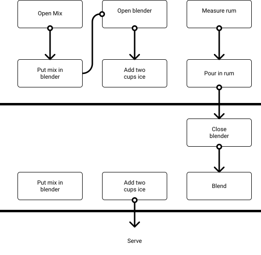
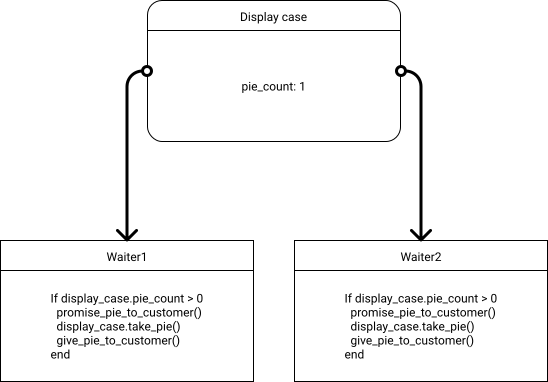

# PRAGMATIC PROGRAMMER

## Assertive Programming

### Use Assertions to prevent the impossible

> Whenever you find yourself thinking "but of course that could never happed." add code to check it.

```c
assert(result != null)
```

```java
assert result != null && result.size() > 0 : "Empty result from XYZ";
```

```c
books = my_sort(find("scifi"))
assert(is_sorted?(books))
```

Don't use assertions in place of real error handling example with IO

Assertions check for things that should never happen.

```c

puts("Enter `Y` or `N`")
ans = gets[0] # Grab first character of response
assert((ch == 'Y') || (ch == 'N')) # Very bad idea!

```

### Assertions and Side Effects

Don't use assertion if the condition has side effects.

```java

while(iter.hasMoreElements()) {
    assert(iter.nextElement() != null); // BAD: iter.nextElement() move the cursor of the iterator
    Object = obj = iter.nextElement();
}

```

### Leave assertions Turned On

### Exercise 16

Which of the "impossible" things can happen ?

- A month with fewer than 28 days -> possible
- Error code from a system call: can't access the current directory -> possible (lock, directory removed, permission error)
- In C++: a=2; b = 3; but (a+b) does not equal 5 -> possible
- A triangle with an interior angle sum = 180° -> possible
- A minute that doesn't have 60 seconds -> possible
- (a+1) <= a -> possible

## How to balance resources

> To light a candle is to cast shadow...

We all manage resources whener we code : memory, transactions, threads, network connections , files, timers -- all kinds of things with limited availability.

### Finish What You Start

This tip is easy to apply in most circumstances. It simply means that the function or object that allocates a resource should be responsible for deallocating it.

```ruby
def read_customer
    @customer_file = File.open(@name + ".rec", "r+")
    @balance       = BigDecimal(@customer_file.gets)
end

def write_customer
    @customer_file.rewind
    @customer_file.puts @balance.to_s
    @customer_file.close
end

def update_customer(transaction_amount)
    read_customer
    @balance = @balance.add(transaction_amount, 2)
    write_customer
end
```

Is bad example @customer_file is shared globaly between the two function.

```ruby

def read_customer(file)
    @balance=BigDecimal(file.gets)
end

def write_customer(file)
    file.rewind
    file.puts @balance.to_s
end

def update_customer(transaction_amount)
    file= file.open(@name + ".rec", "r+")
    read_customer(file)
    @balance = @balance.add(transaction_amount,2)
    file.close
end

```

Instead of holding on the file reference, we've changed the code to pass it as parameter. Now all the responsibility
for the file is in the update_customer routine.

Updgrade with enclosed block if language allow it:

```ruby

def update_customer(transaction_amount)
    File.open(@name + ".rec", "r+") do |file|
        read_customer(file)
        @balance = @balance.add(transaction_amount, 2)
        write_customer(file)
    end
end

```

In this case, at the end of the block the file variable goes out of scope.

### Act Locally

#### Balancing Over Timers

For anything that you create that takes up a finite resource, consider how to balance it.

### Nest Allocations

The basic pattern for resource allocation can be extended for routines that need more than one resource at time.

- Deallocate resources in the opposite order to that in which you allocate them. That way you won't orphan resources if
  one resource contains references to another.
- When allocating the same set of resources in different places in your code, always allocate them in the same order.
  This will reduce the possibility of deadlock.

### Object and Exception

If you are programming in an object-oriented language, you may fnd it useful to encapsulate reources in classes. Each time you need a particular resource type, you instantiate an object of that class.
When the object goes out of scope, or is reclaimed by the garbage collector, the object
destructor then deallocates the wrapped resource.

### Balancing and Exceptions

Languages that support exceptions can make resource dealocation tricky.

You generally have two choices:

1. Use variable scope (for example, stack variables in C++ or Rust)
2. Use a finally clause in a try...catch block

### And Exception Antipattern

We commonly see folks writing something like this:

begin
thing = allocate_resource()
process(thing)
finally
deallocate(thing)

What happens if resource allocation fails and raises an exception ?
The finally clause will catch it, and try to deallocate a thing that was never allocated.

The correct pattern for handling resource deallocation in an environment with exceptions is

thing = allocate_resource()
begin
process(thing)
finally
deallocate(thing)
end

### When You Can't Balance Resources

There are times when the basic resource allocation pattern just isn't appropriate. For
Commonly this is found in programs that use dynamic data structures.

One routine will allocate an area of memory and link it into some larger structure, where it may stay for some time.

The trick here is to establish a semantic invariant for memory allocation. You need to decide who is responsible for data
in an aggregate data structure.

What happens when you deallocate the top-level structure ?

You have three main options:

- The top-level structure is also responsible for freeing any substructures that it contains. These structures then recursively delete data they contain, and so on.
- The top-level structure is simply deallocated. Any structures that it pointed to (that are not referenced elsewhere) are orphaned.
- the top-level structure refuses to deallocate itself if it contains any substructures.

The choice here depends on the circumstances of each individual data structure.
Our preference in these circumstances is to write a module for each major structure that provides standard allocation and deallocation facilities for that strcture. (This module can alswo provide facilities such as debug printng, serialization, deserialization and traversal hooks)

### Checking Balance

Because Pragmatic Programmers trust no one, including ourselves, we feel that it is always a good idea to build code that actually checks that resources are indeed freed appropriately. For most applications, this normally means producing wrappers for each type of resource, and using these wrappers to keep track of all allocations and deallocations.

At certain points in your code, the program logic will dictate that the resources will be in a certain state:
use the wrappers to check this.

### Dont't Outrun Your Headlights

> It's tough to make predictions, especially about the future.

In software development, our "headlights" are similarly limited.
We can't see too far ahead into the future, and the further off-axis you look,
the darker it gets. So pragmatic Programmers have a firm rule:

### Take Small Steps -- Always

Always take small, deliberate steps, checking for feedback and adjusting before proceeding.
Consider that the rate of feedback is your speed limit.
You never tkae on a step or a task that's "too big."

What do we mean exactly by feedback? Anything that independently confirms or disproves your action
For example:

- Results in a REPL provide feedback on your understaning of APIs and algorithms
- Unit tests provide feedback on your last code change
- User demo and conversation provide feedback on features and usability

What's a task that's too big ? Any task that requires "fortune telling" just as the car headlights have limited throw,
we can only see into the future perhaps one or two steps, maybe a few hours or days at most. Beyond that, you quickly gets
pas educated guess and into wild speculation

You might find yourself slipping into fortune telling when you have to:

- Estimate completion dates months in the future
- Plan a design for future maintenance or extendability
- Guess user's future needs
- Guess future tech availiability

Making code replaceable will also help with cohesion, coupling, decoupling, and DRY, leading to a better design overall.

### Black Swans

In his book , [The Black Swan: The impact of the Highly Improbable][].

[the black swan: the impact of the highly improbable]: (https://www.amazon.fr/Black-Swan-Impact-Highly-Improbable/dp/0141034599)

Nassim Nicholas Taleb posits that all significant events in history have come from high-profile,hard-to-predict, and rare events that are beyond the realm of normal expectations. These outliers, while statistically rare,
have disproportionate effects. In addition, our own cognitive biases tend to blind us to changes creeping up on the edges of your work.

### Avoid Fortune-Telling

Much of the time, tomorrow looks a lot like today. But don't count on it.

## Bend, or Break

The code that we write doesn't stand still. We need to make every effort to write code that's as loose -- as flexible -- as possible.

Or we may find our code quickly becoming outdated, or too brittle to fix.

## Decoupling

Coupling is the enemy of change , it links together things that mus change in parallel.
You're designing software that you'll want to change for it to be flexible, individual components should be coupled to as fex other components as possible.

To make matters worse, coupling is transitive.

This means there's a simple principle you should follow:

### Decoupled Code Is Easier to Change

The symptoms of coupling:

- Wacky dependencies between unrelated modules or libraries.
- "Simple" changes to one module that propagate through unrelated modules in the system or break stuff elsewhere in the system.
- Developers who are afraid to change code because they aren't sure what might be affected.
- Meetings where everyone has to attend because no one is sure who will be affected by a change.

### Train Wrecks

We've all seen (and probaly written) code like this:

```java

public void applyDiscount(customer,order_id,discount) {
    totals = customer.orders.find(order_id).getTotals();
    totals.grandTotal = totals.grandTotal - discount;
    totals.discount = discount;
}

```

This chunk of code is traversing five levels of abstraction, from customer to total amounts.
That's a lot of implicit knowledge. But worse that's lot of thing that cannot change in the future.

Let's imagine that the business decides that no order can have a discount of more than 40%.
Where would we put the code that enforce that rule ?

You might say it belongs in the applyDiscount function we just wrote.
But with the code the way it is now. Any piece of code anywhere, could set fields in the totals object.

One way to look at this is to think about responsibilities. Surely the totals object should be responsible for managing the totals. And yet it isn't.

The fix for that is to apply something we call:

### Tell, Don't Ask

You shouldn't make decisions based on the internal state of an object and then update that object.
Doing so destroys the benefits of encapsulation.

Fixed example:

```java

public void applyDiscount(customer,order_id, discount) {
    customer
    .findOrder(order_id)
    .applyDiscount(discount);
}

```

TDA is not a law of nature; it's just a pattern to help us

Here order is a part of customer API. So it's fine to expose it.

### The Law of Demeter

In the relation of coupling the Law Of Demete is a set of rule that in a class C should only call:

1. Other instance methods in C
2. Its parameters
3. Methods in objects that it creates, both on the stack and in the heap
4. Global variables

The global variable should be removed.

### Don't chain method Calls

Try don't to do more than one "." when access something.

Example:

```ruby

# This is pretty poor style

# and so is This

orders = customer.orders;
last = orders.last();
totals = last.totals();
amount = totals.amount;

```

There only one exception thing that don't change a lot like language API

```ruby

people
.sort_by(|person| person.age)
.first(10)
.map(| person | person.name)

```

### Avoid Global Data

Global data includes singletons.
Global Data Includes External Resources.

If it's important Enough to Be Global. Wrap It in an API

### Inheritance Adds Coupling

The misuse of subclassing, where a class interits state and behaviour from another class. Add dangerous coupling

### Again, It's All About Change

Coupled code is had to change, Keeping your code shy will help keep your applications decoupled.

## Juggling the Real World

### Events

An event represents the availability of information.
If we write applications that respond to events adjust what they do based on those events, those applications will work better in the real world.

Let's look at four strategies that help to build that type of application:

1. Finite State Machines
2. The observer Pattern
3. Pusblish / Subscribe
4. Reactive Programming and Streams

### Finite State Machine

#### The Anatomy of a Pragmatic FSM

A state machine is just a specification of how to handle events.
It consists of a set of states, one of which is the current state.
For each state , we list the events that are significant to that state.
For each of thos events, we define the new current state of the system.

For example, we may receiving multipart messages from a web-socket.
The first message is a header. This is followed by any number of data messages,
followed by a trailing message

The neat thing about FMS is that we can express them purely as data.
Here's a table representing our message parser

| State   | Events  |         |         |       |
| ------- | :-----: | :-----: | :-----: | :---: |
|         | Header  |  Data   | Trailer | Other |
| Initial | Reading |  Error  |  Error  | Error |
| Reading |  Error  | Reading |  Done   | Error |

Tehe code that handles its is equally simple:

```ruby

TRANSITIONS = {
    initial: {header: :reading},
    reading:{data: :reading, trailer: :done},
}

state = :inital

while state != :done && state != :error
    msg = get_next_message()
    state = TRANSITIONS[state][msg.msg_type] || :error
end

```

### Adding Actions

You can beef a FSM by adding actions that are triggered on certain transitions.

For example, we might need to extract all of the strings in a source file.
A string is text between quotes, but a backslash in a string escapes the next character,
so "ignore \"quotes\"" is a single string.


event/strings_fsm.rb

```ruby

TRANSITIONS = {
    look_for_string: {
        ''''=> [:in_string,:start_new_string],
        :default => [:look_for_string, :ignore]
    },

    in_string: {
        '''' => [:look_for_string, :finish_current_string],
        '\\' => [:copy_next_char, :add_current_to_string],
        :default => [:in_string, :add_current_to_string],
    ],

    copy_next_char: {
        :default => [:in_string, :add_current_to_string],
    },
}

```

event/strings.fsm.ruby

```ruby

state = :look_for_string
result = []

while ch = STDIN.getc
state, action = TRANSITIONS[state][ch] || TRANSITIONS[state][:default]
case action
when :ignore
when :start_new_string
result = []
when :add_current_to_string
result << ch
when :finish_current_string
puts. result.join
end
end


```

In this example the result of each transition is both a new state and action.

### The Observer pattern

In the observable pattern we have a source of events, called the observable and a list of clients, the observers, who are listening for those events.

An observer registers its interest with the observable, typically by passing a reference to a function to be called.

[Example](./examples/event/observer.rb)

### Publish/Subscribe

Publish/Subscribe (pubsub) generalizes the observer pattern , at the time solving the problems of coupling and performance.
In the pubsub model, we have publishers and subscribers.
They are connected via channels. The channels are implemented in seprate body of code: sometimes a library, sometimes a process, and sometimes a
distributed infrastructure.

Communication between the publisher and subcriber is handled outise your code, and is potentially asynchronous.

The downside is that it can be hard to see what is going on in system that uses pubsub heavily.

Compared to the observer pattern, pubsub is a great example of reducing coupling by abstracting up through a shared interface (the channel)

### Reactive Programming, Streams, and Events

[Example](./examples/event/rx1/index.js)

#### Streaùs of events are asynchronous Collections

Event streams unify synchronous and asynchronous processing behind a common convenient API. This

### Events Are Ubiquitous

Events are everywhere. Some are obvious: a button click, a timer expiring.
Other are less so: someone logging in, a line in a file matching a pattern. But whatever their source, code that's crafted around events can be more responsive and better dcoupled than its more linear counterpart.

## Transforming

All prgrams transform data, converting an input into an output. And yet when we think about design, we rarely think about creating transformations.
Instead we worry about classes and modules, data structures and algorithms, languages and frameworks.

IF we ask a unix programmer to write us a program that lists the five longest files in a directory, where longest means "having the largest number of lines."
It will probaly do something like this:

```sh
    find . -type f | xargs wc -l | sort -n | tail -5
```


Our original requirement, "top 5 files in terms of lines" becomes a series of transformations:

directory name

- list of files
- list with line numbers
- sorted list
- highest five + total
- highest five

Like an industrial assembly line: feed raw data in one end and the finished product (information) comes out the other.

Code should be through the same way.

> Programming Is About Code, But Programs Are About Data

Finding Transformations

TThe easiest way to find the transformations is to start with the requirement and determine its inputs and ouputs.

This approach is called top-down.

Example with a website for folks playing word games that finds all the the words that can be made from a set of letters.

Input: Set of letters , Output: List of three-letter words, four-letter words and so on:

3 => ivy,lin,nil,yin

Lvying is transformed to 4 => inly,liny,viny
5 => vinyl

The trick for the application is to have a dictionary which groups words by a signature, chosen so that all words containing the same letters will have the same signature.

| Step    | Transformation                                                  | Sample data                                                           |
| ------- | --------------------------------------------------------------- | --------------------------------------------------------------------- |
| Step O: | Initial input                                                   | ylvin                                                                 |
| Step 1: | All combinations of the tyhree or more letters                  | vin,viy,vil,vny,vnl,iny,inl,iyl,nyl,viny,vinl,viyl,vnyl,inyl,vinyl    |
| Step 2: | Signatures of the combinations                                  | inv,ivy,ilv,nvy,lnv,lvy,iny,iln,ily,lny,mvy,ilnv,ilvy,lnvy,ilny,ilnvy |
| Step 3: | List of all dictionnary words which march any of the signatures | ivy,yin,nil,lin,viny,liny,inly,vinyl                                  |
| Step 4: | Words grouped by length                                         | 3 => ivy, lin, nil, yin 4 => inly, liny, viny 5 => vinyl              |

Transformations All the Way Down

Every step in the first table can be breaken down futher

| Step 1.0  | Transformation                          | Sample data                                                                            |
| --------- | --------------------------------------- | -------------------------------------------------------------------------------------- |
| Step O:   | Initial input                           | vinyl                                                                                  |
| Step 1.1: | Convert to characters                   | v,i,n,y,l                                                                              |
| Step 1.2: | Get all subsets                         | [],[v],[i] ... [v,i],[v,n],[v,y]...[v,i,n],[v,i,y] ... [v,n,y,l],[i,n,y,l],[v,i,n,y,l] |
| Step 1.3: | Only those longer than three characters | [v,i,n],[v,i,y],...[i,n,y,l],[v,i,n,y,l]                                               |
| Step 1.4: | Words grouped by length                 | 3 => ivy, lin, nil, yin 4 => inly, liny, viny 5 => vinyl                               |

With that we can now implement each transformations

[Anagrams](./examples/transform/anagrams.ts)

### Transformations Transform Programming

Thinking of code as a series of transformations can be liberating approach to programming.

// TODO: Exercise 21
// TODO: Exercise 22
// TODO: Exercise 23

## Inheritance Tax

### Problems Using Inheritance to Share Code

Inheritance is coupling. The child class is coupled to the parent and the code that use the child is coupled to all ancestors.

// TODO: Exercise in javascript

```ruby

class Vehicle

def initialize
@speed = 0
end

def stop
@speed = 0
end

def move_at(speed)
@speed = speed
end

class Car < Vehicle

def info
"I'm car driving at #{@speed}"
end

end

# top-level code

my_ride = Car.new
my_ride.move_at(30)

```

In this example its the vehicle method of move_at that is called.
Now if the API of vehicle change and move_at became set_velocity and the instance variable @speed becomes @velocity.
The child class will break.

An API change is expected to break clients of Vehicle class. But the top-level is not: as far as it is concerned it is using a Car.
What hte Car class does in terms of implementation is not the concern of the top-level code, but it still breaks.

Similarly the name of an instance variable is purely an internal implementation detail, but when Vehicle changes it also (silently) breaks Car.
So much coupling.

### Problems using inheritance to Build Types

inhereritance shouldn't be a way of defining new types.
Their favorite design diagram shows class hierarchies.

These hierachies soon grow into wall-covering monstrosities, layer-upon-layer added in order to express the smallest nuance of
differentiation between classes.

This added complexity can make the application more brittle, as changes can ripple up and down many layers.

Don't Pay Inheritane Tax

### The Alternative Are Better

Three techniques that mean you should never need to use inheritance again:

1. Interfaces and Protocols
2. Delegation
3. Mixins and traits

### Interfaces and Protocols

Most OO languages allow you to specify that class implements one or more sets ofe behaviors.

Example with Car: Car class implements Drivable and Locatable behavior.

What makes interfaces and protocols so powerful is that we can use them as types.

Interfaces and protocols give us polymorphism without inheritance.

### Delegation

Preferer delegation over inheritance:

```ruby

// BAD
class Account < PersistenceBaseClass
end

// GOOD
class Account
def initialize(...)
@repo = Persister.for(self)
end

def save
@repo.save()
end
end

```

Now that we're no longer constrained by the API of the framework we're using, we're free to create the API we need.

Delegate to Services Has-A Trumps Is-A

```ruby

class Account
# nothing but account stuff
end

class AccountRecord
# wraps an account with the ability
# to be fetched and stored
end

```

Now the code is decoupled but at the cost of having to write more code, and typically some of it will be boilterplate.
It's likely that all our record classes will need a find method. That what mixins and traits do for us.

Mixins, Traits, Categories,Protocols extensions, ...

Mixin give the ability to extend classes and object with new functionality without using inheritance.

Example mixin for common persistence methods:

```ruby

mixin CommonFinders {
    def find(id){...}
    def findAll() {...}
end
}

```

As an example, let's go back to our AccountRecord example. As we letf it, an AccountRecord needed to know about both accounts and about our persistence framework. It also needed to deleagte all the methods in the persistence layer that it wanted to expose to the outside world.

Mixins give us an alterantive. Write the standard method in the mixin and add them into AccountRecord

```ruby

mixin CommonFinders {
    def find(id) {...}
    def findAll() { ... }
end

}

class AccountRecord extends BasicRecord with CommonFinders
class OrderRecord extends BasicRecord with CommonFinders

```

Example with validation:

```ruby

class AccounForCustomer extends Account with AccountValidations,AccountCustomerValidations

class AccountForAdmin extends Account with AccountValidations,AccountAdminValidations

```

Use mixins to Share Functionality

Inheritance Is Rarely the Answer

### Configuration

Values that may change after the application has gone live, or value specifique to customers should be keep outside of the app.

Parameterize Your App Using External Configuration.

### Configuration As Service

Configuration can also be stored behind a service API. This has a number of benefits:

- Multiple applications can share configuration information, with authentification and access control limiting what each can see.
- Configuration changes can be made globally.
- The confgiuration data can be maintained via a specialized UI.

### Don't Write Dodo-Code

### Don't Overdo It

Don't Overdo it and Don't push decisions to configuration out of laziness.

## Concurrency

Concurrency is when the execution of two or more pieces of code act as if they run at the same time.
Parallelism is when they do run at the same time.

To have concurrency, you need to run code in environment that can switch execution between different parts of your code when it is running. This is often implemented using thins such as fibers, threads, processes.

The biggest difficulty with concurrency is shared state. This doesn't just mean global variables: any time two or more chunks of code hold references to the same piece of mutable data, you have shared state.

There is workarounds for this but ultimately they're all error prone.

### Breaking Temporal Coupling

There are two aspects of time that are important to us: concurrency and ordering.
When people first sit down to design an architecture or write a program, things lend to be linear.
That's the way most people think do this and then always do that.
But thinking this way leads to temporal coupling: coupling in time.

This approach is not very flexible , and not very realistic.

We nned to allow for concurrency and to think about decoupling any time or order dependencies. In doing so
we gain flexibility and reduce any time based dependencies in many area of development:
workflow analysis, architecture, design , and deployment.

### Looking for Concurrency

#### Analyse workflow to Improve Concurrency Using Activity Diagram

An activity diagram consists of a set of actions drawn as rounded boxes. TheThe arrow leaving an action leads to either
another action (which can start once the first action completes) or a thick line called a synchronization bar.
When actions leading to a synchronization bar is finis, you can proceed along any arroww leaving the bar.
An action without arrow can be started any time.

Activity Diagrams can be used to identifying process that could be perform in parallel but aren't.

Example with robotic pina colada marker:

1. open blender
2. open pina colada mix
3. put mix in blender
4. measure 1/2 cup white rum
5. Pour in rum
6. Add 2 cups of ice

7. Close blender
8. Liquefy for 1 minute
9. Open blender
10. Get glasses
11. Get pink umbrellas
12. Serve

Even though these actions are describe serially, many of them could be performed in parallel.



Activity diagram show the potential areas of concurrency
When can find activities that take time, but not time in
our code.Querying a dataabase, accesing an external service, waiting for user input.

### Opportunties for parallelism

Remember the distinction: concurrency is a software mechanism, and paralleslims is a hardware concern.

If we have multiple processors either locally or remotely, then if we can split work out among them we can reduce the overall time things take.

The ideal things to split this way are pieces of work that are relatively indepedent, where each can proceed without waiting for anyhting from the others. A common pattern is to take a large piece of work, split it into independant chunks, process each in parallet , then combine the result.

## Shared State Is Incorrect State

Example:

You're in your favorite diner. YOu finish your main course, and ask your server if there's any apple pie left.

He lloks over his shoulder, sees one piece in the display case and says yes. You order it and sight contentedly.

Meanwhile, on the other side of the restaurant, another customer asks their server the same question. She also looks, confirms there's a piece, and that customer orders.

One of the customers is going to be disappointed.

### Nonatomic Updates



Waiter 1 gets the current pie count, and finds that it is one. He promises the pie to the customer.
But at that point waiter 2 runs and she alos sees the pie count is one and make the same promise to her customer.
The problem here is not hat two processes can write to the same memory. The problem is that neighter process can guarantee that its view of that memory is consistent.

### Semaphores and Other Forms of Mutual Exclusion

A semaphore is simply a thing that only one person
can own at a time.
You can create a semaphore and the use it to control access to some other resource.

example with waiter:

```ruby

case_semaphore.lock()

if display_case.pie_count > 0

promise_pie_to_customer()
display_case.take_pie()
give_pie_to_customer()

end

case_semaphore.unlock()

```

### Make the resource Transactional

The current design is poor because it delegates responsibility for protecting acces to the pie case to the people who use it.

To do this, we have to change the API so that waiters can check the count and alose take a slice in a single call:

```ruby

slice = display_case.get_pie_if_available()
if slice
give_pie_to_customer()
end

```

To make this work, we need to write a method that runs as port of the display cas itself:

```ruby
def get_pie_if_available()
@case_semaphore.lock()
try {
    if @slices.size > 0
    update_sales_data(:pie)
    return @slices.shift
    else
    false
    end
    end
} ensure{
    @case_semaphore.unlock()
 }
```

#### Random Failures Are Often Concurrency Issues

## Actors and processes

Actors and processes offer ways of implementing concurrency without the burden of synchronizing access to shared memory.

Actor
: An actor is an independent virtual processor with its own local ( and private) state.
Each actor as a mailbox.
When a message appears in te mailbox and the actor is idle, it kicks into life and processes the message. When it finishes processing, it processes another message in the mailbox, or , if the mailbox is empty, it goes back to sleep.

Process
: A process is typically a more general-purpose virtual processor, often implemented by the operating system to facilitate concurrency. Processes can be constrained (by convention) to behave like actors, and that's the type of process we mean here.

### Actor can only be concurrent

There are thing that are not in the definition of actors:

- There's no single thing that's in control. Nothing schhedules what happens next, or orchestrates the transfer of information from the raw data to the final output

- State in the system is held in messages and in the local state of each actor.Messages cannot be examined except by being read by their recipient, and local state is inaccesible outised the actor.
- All messages are one way there's no concept of replying. If you want an actor to return response, you include your own mailbox address in the message you send it, and it will (eventually) send the response as just another message to that mailbox.

- An actor processes each message to completion, and only processes one message at a time.

As a result, actors execute concurrently, asynchronously and share nothing. If you had enough physical processors you could run an actor on each. If you have a single processor, then some runtime can handle the switching of context betweenb them. Either way, the code running in the actors is the same

> Use Actors for Concurrency Without Shared State

### A Simple Actor

Let's implement our diner using actors. In this case, we'll have three (the customer, the waiter, and the pie case).

the overall message flow will look like this: this

- We ( as some kind of external, God-like being) tell the customer that they are hungry
- second
- In response, they'll ask the waiter for pie
- The waiter will ask the pie case to get some pie to the customer
- If the pie case has a slice available, it will send it to the customer, and also notify the waiter to add it to the bill
- If there is no pie, the case telle the waiter, and te waiter apologizes to the customer

The customer can receive three messages:

- You're hungry ( send by the external context)
- There's pie on the table ( sent by pie case )
- Sorry, there's no pie ( send by the waiter )

[Actor/Processus](./examples/actors/index.ts)

### No Explicit Concurrency

In the actor model, there's no need to write any code to handle concurrency as there is no shared state. There's also no need to code in explicit end-to-end "do this, do that" logic, as the actors work it out for themselves based on the messages they receive.

There's also no mention of the underlying architecture. This set of components work equally well on a single processor, on multiple cores, or multiple networked machines.

### Erlang Sets the Stage

The erlang language and runtime are great examples of an actor implementation. Erlang calls actors processes.

Erlang processes are lightweight and they communicate by sending messages.
Each is isolated from the others, so there is no sharing of state.
In addition, the Erlang runtime implements a supervision system which manages the lifetimees of set of processes in case of failure.

### Blackboards

Consider how detectives might use a blackboard to coordinate and solve a murder investigation.
The chief inspector starts off by setting up a large blackboard in the conference room. On it , she writes a single question:

H.Dumpty (Male,Egg): Accident ? Murder ?

> Use blackboards to Coordinate workflow

Each detective make contributions to this potentail murder mystery by adding facts, statetements, forensic evidence that might arise, and so on

Some key features of the blackboard approach are :

- None of the detective needs to know of the existence of any other detective they watch the board for new information, and add their findings
- The detectives may be trained in different disciplines, may have different levels of education and expertise, and may not even work in the same precinct. They share a desire to solve the case, but that's all.
- Different etectives may come and go during the course of the process, and may work different shifts.
- There are no restrictions on what may be placed on the blackboard. It may be pictures, sentences, physical evidence, and so on.

This is a form of laissez faire concurrency. The detecctives are independent processes, agents, actors and so on. Some store facts on the blackboard. Other take facts off the board, maybe combining or processing them, and add more information to the board.

Computer base blackboard systems were originally used in artificial intelligence applications.
where the problems to solved were large and complex speech recognition, knowledge based reasoning systems, and so on.

### A blackboard in Action

Suppose we are writing a program to accept and process mortgage or loan applications.
Te laws that govern this area are odiously complex, with federal, state, and local governments all having their say.

The lender must prove they have disclosed certain things, and must ask for certain information - but must not ask certain other questions, and so on ,and so on. Some

There is also the following problems to contend with:

- Responses can arrive in any order. For instance, queries for a credit check or title search may take a substantial amount of time, while items such as name and address may be available immediately.
- Data gathering may be done by different people, distributed across different offices, in different time zones
- Some data gathering may be done automatically by other systems. This data may arrive asynchronously as well.
- Nonetheless, certain data may still be dependent on other data. For instance , you may not be able to start the title search for a car until you get proof of ownership or insurance.
- The arrival of new data may raise new questions and policies. Suppose the credit check come back with a less glowing report; now you need these five extra forms and perhaps a blood sample.

You can try handle every possible combination and circumstance using a workflow system. Here
Many such systems exist, but they can be complex and programmer intensive.
As regulation change, thew workflow muste be reorganized: people may have to change their procedures and hard-wired code may have to be rewritten.

A blackboard, in combination with a rulesengine that encapsulates the legal requirements, is an elegant solution to the difficulties found here. Order of data arrival is irrelevant: when a fact is osted it can trigger the appropriate rules.

Feedback is easily handled as well: the output of any set of rules can post to the blackboard and cause the triggering of more applicable rules.

> Use blackboard to Coordinate Workflow

### Messaging systems can be like Blackboards

Many applications (micro service) are constructed using small, decoupled service, all communicating via some form of messaging sytem. These messasing systems (such as Kafka and NATS)
do far more thant simply send data from A to B. In particular they offer persistence (in form of an evant log) and the ability to retrieve messages though a form of pattern matching. This means you can use them both as a blackboard system and or as platform on which you can run a bunch of actors.

### But It's Not That Simple

The actor and/or blackboard and/or microservice approach to architecture removes a whole class of potential concurrency problems from your applications. But that benefit comes at a cost. These approaches are harder to reason about, because a lot of the action is indirect. You'ill find it helps to keep a central repository of message formats and/or APIs, particularly if the repository can generate the code and documentation for you.You'll also need good tooling to be able to trace messages and facts as they progress through the system. You

Finally, these kinds of system can be more troublesome to deploy and manage, as there are more moving parts. To some extend this offset by the fact that the system is more granular, and can be updated by replacing individual actors, and not the whole system.

## While your are coding

Many people thinks that when a project is a coding phase, the work is mostly mechanical, transcribing design into executable statements.

That attitute is a big reason that software projects fail, and many sytems end up ugly, inefficient, poorly structured, unmaintainable, or just plain wrong.

Coding is not mechanical. If it were , all the CASE tools that people pinned their hopes on way back in the early 1980s would have replaced programmers long ago.

There are decisions to be made every minute , decisions that require careful thought and judgment if the resulting program is to enjoy a long, accurate, productive life.

Not all decisions are even conscious. You can harness your instincts and nonconscious thoughts when you Listen to Your Lizard Brain.

Listening to your instincts doesn't mean you can fly on autopilot. Developers who don't actively think about their code are programming by coincidence. The code might work, but there's no particular reason why.

While most of code are fast, sometime we develop algorithms that have the potential to bog down the fastest processors. Algorithms Speed is a ways to estimate the speed of code.


Testing is not about finding bugs, it's about getting feedback on your code: aspects of design, the API, coupling, and so on. The

That means that the major benefits of testing happend when you think about and write them.

It's critical that code is readable and easy to reason about.

One of the hardest things in software development is Naming Things.